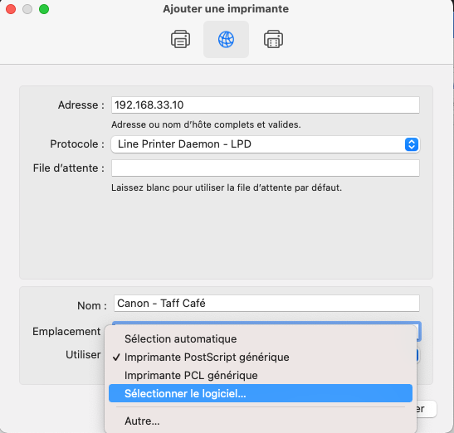
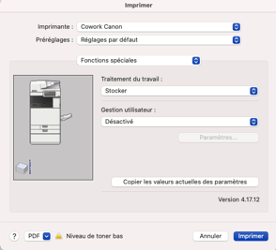
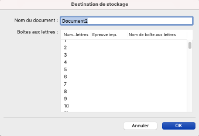

# Guide imprimante Taff Café – Mac OS

## Installation

- Télécharger driver postscript pour Canon iR-ADV C3525/3530
- Lien : https://www.canon.fr/support/products/imagerunner/imagerunner-advance-c3530i-iii.html , puis télécharger PS Printer Driver & Utilities for Macintosh
- Menu   / Préférences Système / Imprimantes et scanners
- Ajout Imprimante / LPD Printer Daemon – LPD
- Adresse : 192.168.33.10
- Sélectionner logiciel / Canon iR-ADV C3525/3530 III PS

## Impression
Lors du lancement d’une impression avec l’imprimante, allez dans le menu Fonctions spéciales pour choisir l’option de Traitement du travail Stocker.

Lors de l’appui sur le bouton Imprimer, choisissez un numéro de boîte. Allez vérifier auparavant que la boite que vous choisissez est non attribuée à un membre de l’espace de coworking et non protégée par un code pin.
 

